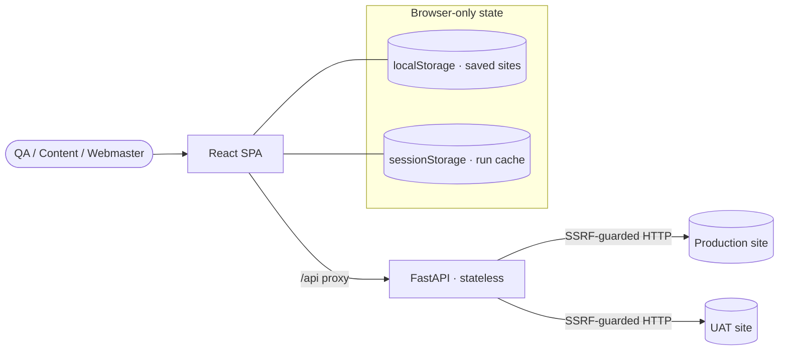
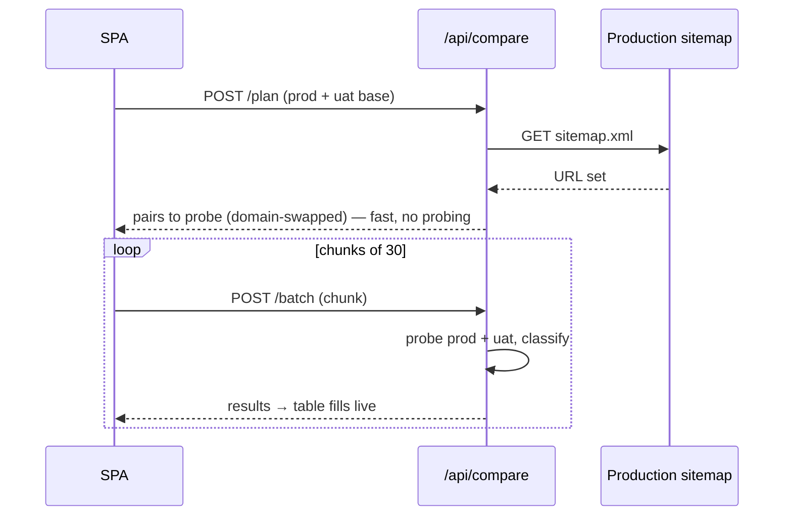

<div align="center">

# PiKaOS-Standalone — Website Compare

**Catch what changed between UAT and Production before you go live** — sitemap coverage + a deep,
section-by-section content diff, in a single self-contained app. No login. No database.


**[⬇️ Download v0.1](https://github.com/hellOoSaksit/PiKaOS-Standalone/releases/latest)** ·
source in [`PikaOS-Compare/`](PikaOS-Compare)

</div>

> **Reader’s note.** Written as a compact **Business Analysis (BA)** + **System Analysis (SA)** dossier
> — problem, stakeholders, scope, requirements, and the system design. This repo is the *standalone*
> line of the [PiKaOs](https://github.com/hellOoSaksit/PiKaOs) platform: each build is a single
> capability extracted to run on its own.

---

## 1. Executive summary

Before a website release, the staging/UAT build and Production inevitably **drift**: a page is missing
on UAT, a link 404s, a PDF is last year’s, a heading or paragraph was edited on one side only, an SEO
tag regressed. Finding these by hand is slow and unreliable. **Website Compare** automates it: it treats
**Production’s sitemap as the source of truth**, maps every URL onto the UAT host, and reports coverage —
then, on demand, performs a **deep content diff** that pinpoints *exactly which section differs, on which
side*, with a one-click jump to that spot on the live page.

It runs as **two small containers** (an API + a UI) with **no database, no login** — deployable by a QA
or content team on any machine with Docker.

---

## 2. Business analysis (BA)

### 2.1 Problem statement
UAT-vs-Production parity is a **release-gate** concern owned by people who are not engineers (QA, content
editors, webmasters). They need to answer, quickly and defensibly: *Is every Production page present and
reachable on UAT? Where does the actual content differ — and is that difference intended?*

### 2.2 Stakeholders & personas
| Persona | Need |
|---|---|
| **QA / Release gatekeeper** | A pass/fail coverage map across the whole site before sign-off |
| **Content editor** | “Which paragraphs / headings / files differ?” — in plain, side-by-side form |
| **Webmaster / SEO** | Title, meta, canonical, `og:*`, broken links & missing images |
| **Developer** | Body-similarity %, broken internal links, frameability — with the exact URLs |

### 2.3 Scope
**In scope:** sitemap-coverage comparison; deep per-page diff (content, headings, SEO meta, links,
images, downloadable files); direct two-URL comparison; per-side credentials for login-gated sites;
reusable saved sites; result caching. **Out of scope (by decision):** rendering a pixel preview of a
JS/SPA page (would require a headless browser — a deliberate non-goal); crawling beyond the sitemap;
any persistence server-side.

### 2.4 Functional requirements
- **FR-1 Coverage** — read Production’s `sitemap.xml`, domain-swap each URL onto UAT, probe both sides, classify: `match · redirect · missing · broken · error`, plus UAT-only “extra” URLs.
- **FR-2 Deep diff** — fetch full HTML of matched pages and compare **title / H1 / meta / canonical / `og:*`**, the **H1–H6 heading outline**, a **block-by-block body diff**, **image & internal-link** existence, and **downloadable files matched by filename**.
- **FR-3 Locate the change** — click any differing block or heading to **open the live page scrolled to and highlighting that exact text** (native scroll-to-text-fragment).
- **FR-4 Direct pair** — compare two exact URLs (even unrelated sites) without a sitemap.
- **FR-5 Login-gated sites** — per-side HTTP Basic / header credentials, dispatched by host, never logged.
- **FR-6 Reuse & resume** — saved Prod/UAT site presets (+ creds) and a per-run cache that survives reloads; raising the deep page-limit fetches **only the new pages** (incremental).

### 2.5 Non-functional requirements
| Attribute | Requirement |
|---|---|
| **Safety (SSRF)** | Reject URLs resolving to private/loopback/cloud-metadata IPs — on the first request *and every redirect hop*. |
| **Politeness** | Default-modest outbound concurrency + retries so a WAF/CDN doesn’t throttle the burst into false “broken” noise. |
| **Latency tolerance** | Work is **streamed in small batches** so no single request exceeds the proxy timeout on slow, WAF-fronted sites. |
| **Footprint** | Stateless: no DB/redis/object-store. Stdlib-only HTML parsing — five backend dependencies total. |
| **Privacy** | Credentials live in memory (run) / this browser only (saved). Nothing is sent anywhere but the two sites being compared. |

### 2.6 Primary use case — “Pre-release parity check”
1. Enter the Production and UAT base URLs → **Compare**.
2. The coverage table fills live; sort “differences first”. Missing / broken pages surface at the top.
3. Toggle **Deep** to diff the top N matched pages; expand a row to see the section-level diff.
4. Click a changed paragraph/heading → the live page opens highlighting it → confirm intended vs regression.
5. Save the site pair for next release.

---

## 3. System analysis (SA)

### 3.1 Context & containers



No server-side state exists; the only persistence is in the user’s browser.

### 3.2 Coverage flow (streamed)



Splitting **plan** (read the sitemap) from **batch** (probe in chunks) is what keeps a 260-URL site from
overrunning the proxy timeout — each request stays short, and the table fills progressively with a
Cancel that actually aborts the in-flight outbound work.

### 3.3 Deep-diff pipeline (per page)
`fetch HTML → strip chrome (nav/header/footer) → extract {title, H1–H6 outline, content blocks, meta,
images, internal links, files} → align with an LCS block diff → probe image/link existence (throttled) →
classify the difference`. The body diff is **block-aligned**, so the UI shows *which* paragraph changed,
side-by-side, rather than a wall of text. Headings are diffed as a structured **outline**; downloadable
files are matched **by filename** across hosts (a stale `…2024.pdf` vs `…2025.pdf` surfaces even though
the URLs differ).

### 3.4 Notable engineering techniques
- **Locate-the-change via Text Fragments** — each diff block links to `…#:~:text=…`, so a modern browser scrolls to and highlights the exact text on the *live* page. Zero dependency; degrades gracefully.
- **Incremental deep mode** — coverage and already-fetched pages are cached per direction; raising the page limit fetches only the delta instead of restarting.
- **WAF-aware probing** — a shared semaphore caps *total* sub-requests (not just pages); polite defaults + retries prevent a burst from being throttled into false negatives.

### 3.5 API surface
| Endpoint | Purpose |
|---|---|
| `POST /api/compare/plan` | Read sitemap(s) → URL pairs to probe (fast) |
| `POST /api/compare/batch` | Probe one chunk of pairs → coverage |
| `POST /api/compare/deep` | Deep-diff one small batch of page pairs |
| `GET  /api/health` | Liveness |

---

## 4. Getting started

```bash
# unzip the release, then:
cd PikaOS-Compare
docker compose up -d --build      # backend + frontend (no db/redis/minio)
# open http://localhost:5173   — no login
```
On Windows you can double-click `PikaOS-Compare/start-compare.bat`. Configuration is optional
(`.env.example` → `.env`): CORS origin, the SSRF guard toggle, and an optional host allowlist.

---

## 5. Design decisions (log)

| Decision | Choice | Rationale |
|---|---|---|
| Server state | **None (stateless)** | Comparison needs no persistence → trivial to deploy & scale |
| HTML parsing | **Python stdlib only** | No extra dependency, no image rebuild on logic changes |
| Long requests | **Stream in batches** | Stay under the proxy timeout on slow, WAF-fronted sites |
| Page preview | **Removed (open live instead)** | A faithful SPA preview needs a headless browser — a deliberate non-goal |
| Locate-the-change | **Native text fragments** | Scroll-to-highlight on the live page with zero dependency |

---

<div align="center">

Extracted from **[PiKaOs](https://github.com/hellOoSaksit/PiKaOs)** · Author — Saksit Chuenmaiwaiy
· built as a full-stack + BA/SA portfolio piece.

</div>
